# iot_kit

<html>
<head>

<meta charset="UTF-8">
<meta http-equiv="Content-Type" content="text/html; charset=UTF-8">
<meta http-equiv="X-UA-Compatible" content="IE=EmulateIE10" />
<meta http-equiv="X-UA-Compatible" content="IE=edge">

<!--ここから上はお決まりの定型文です-->

<!--ここからが表現の書式などを決めるcssという部分-->

<link href="https://cdnjs.cloudflare.com/ajax/libs/lightbox2/2.7.1/css/lightbox.css" rel="stylesheet">

</head>

<body>

  モバイル端末をお使いの場合は、画面を横向きにすると
  より見やすくご覧頂けます。

    
<!--ここまでは定型文としてそのままコピペして再利用します—->

<!-—リンクの作り方、例
<a href="ここにリンク先のURLを入れる" target="_blank" rel="noopener noreferrer">新規タブで開く</a>-—>

<!-—ぱんくずリストの表示例-—>
<!--今回は未使用

<a href="https://torokoid.github.io/fts_home">Home</a>>同窓会

—->

<!—-表題の表示、背景黄色、流れ文字の例-->
<h1><marquee behavior="alternate">!!! 2021年9月30日(木)に申し込んだ IoT 学習キットが、10月6日(水)に届きました !!!</marquee></h1>

<!--

-->

<!--QRコードの表示例--><!--

 アクセス用QRコード
-->

                             
<h3>IoT学習キットの無償モニター募集です。 センサーの情報を特定省電力無線でラズパイに飛ばしてグラフ表示するというアイテム。 当たらないだろうな〜と思って申し込んだら、電話がかかって来て6日後には到着しました ！</h3>
<a href="20211006_009.png" data-lightbox="abc">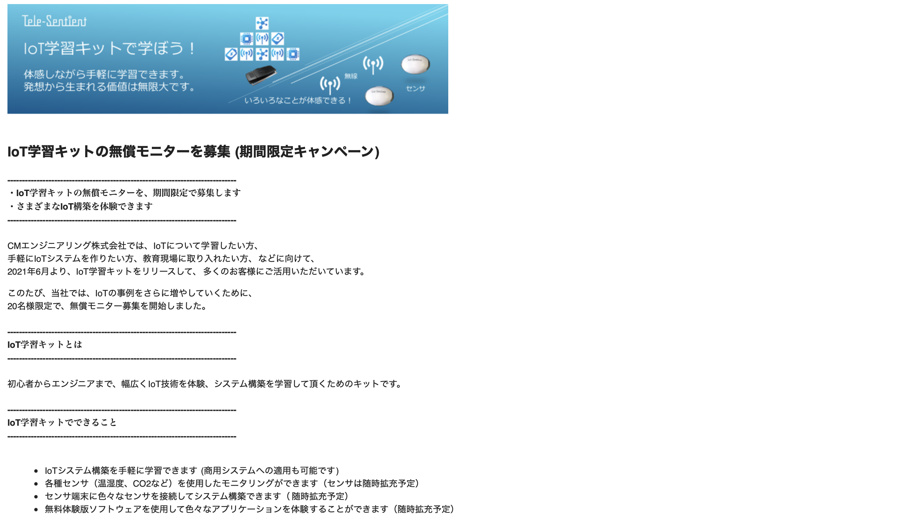</a>
<h3>届いたのはこんな部品。</h3>
<a href="20211006_001.jpg" data-lightbox="abc">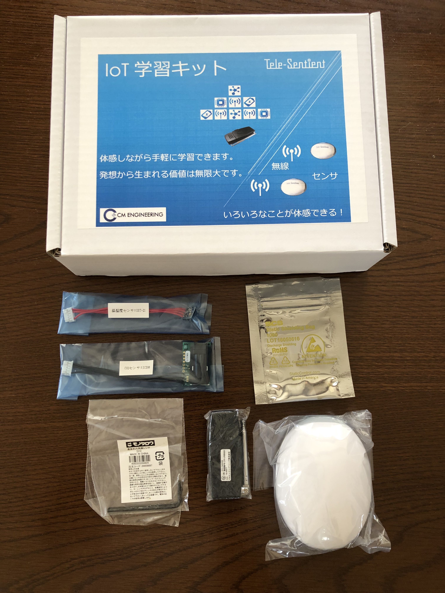</a>
<a href="20211006_002.jpg" data-lightbox="abc">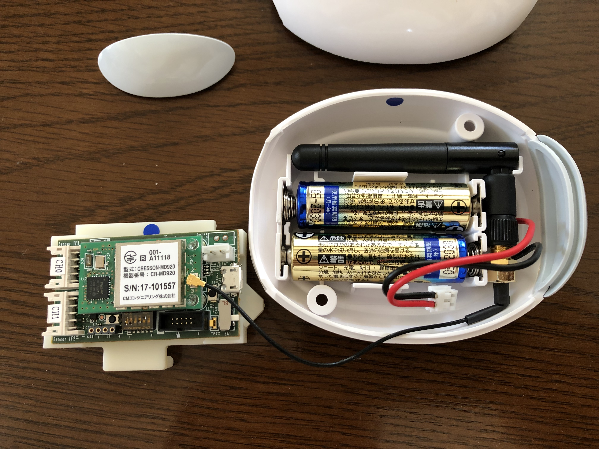</a>
<a href="20211006_003.jpg" data-lightbox="abc">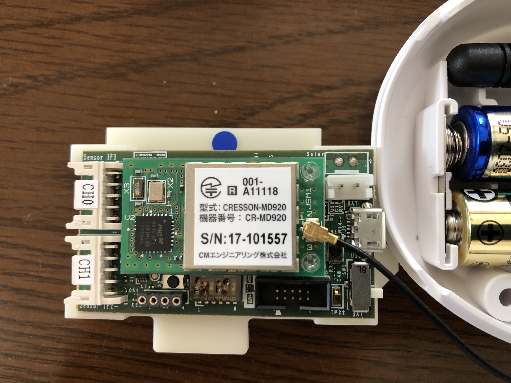</a>
<h3>取説はNetにもありましたが、紙で入ってました。</h3>
<a href="20211006_010.jpg" data-lightbox="abc">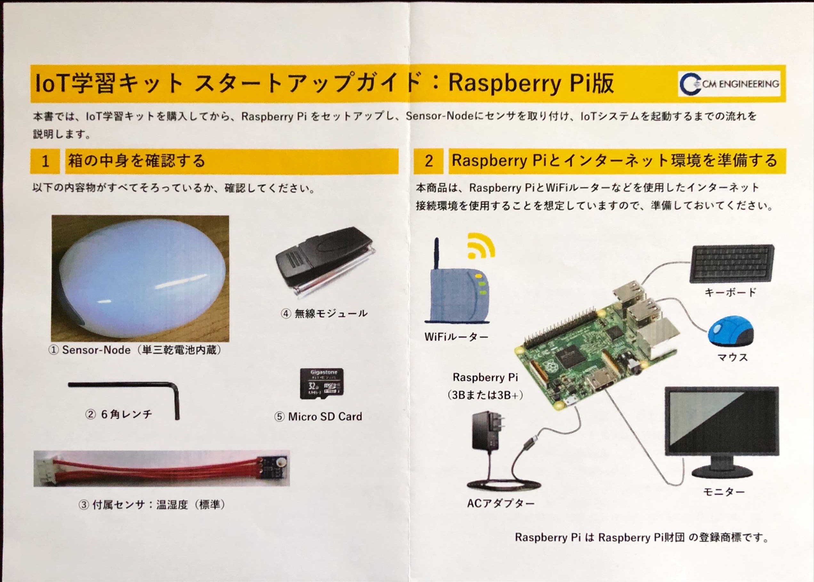</a>
<a href="20211006_011.jpg" data-lightbox="abc">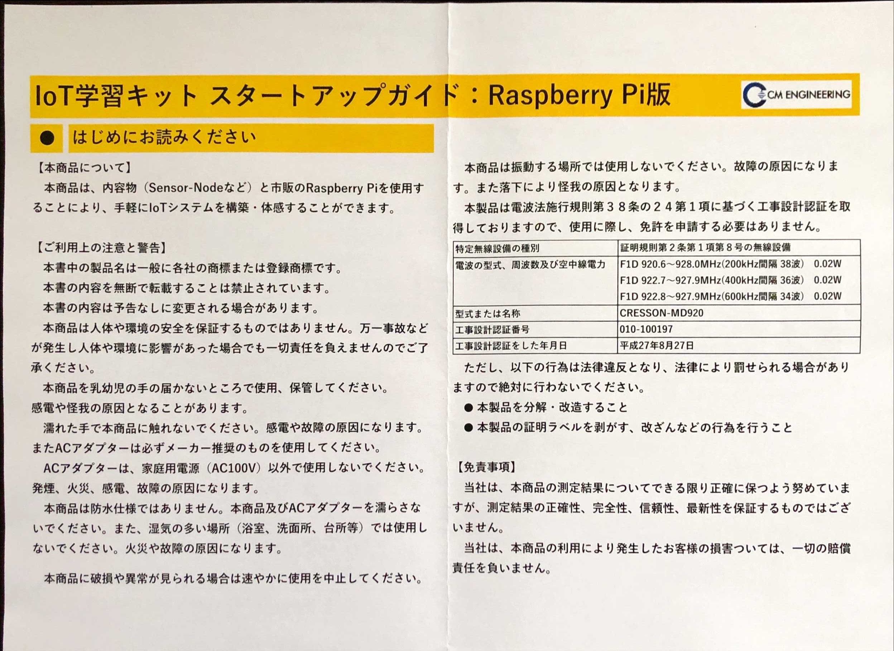</a>
<a href="20211006_012.jpg" data-lightbox="abc">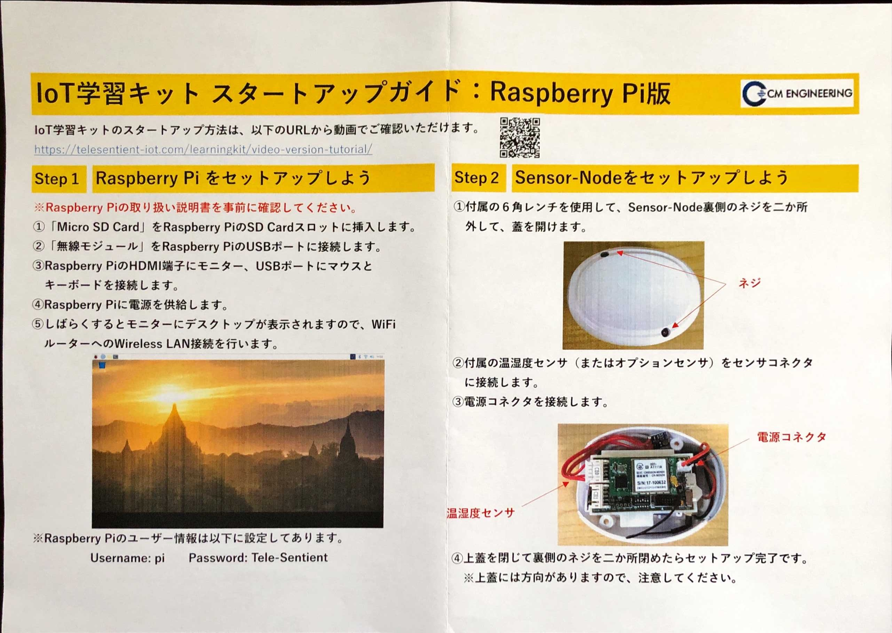</a>
<a href="20211006_013.jpg" data-lightbox="abc">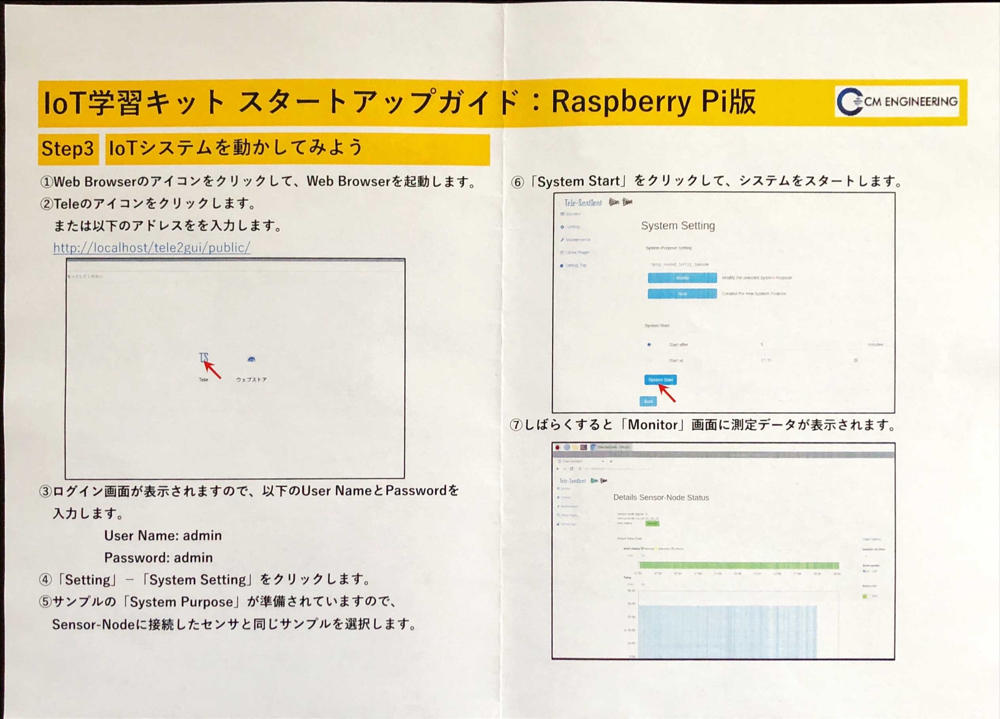</a>
<!--
<a href="20211006_004.jpg" data-lightbox="abc">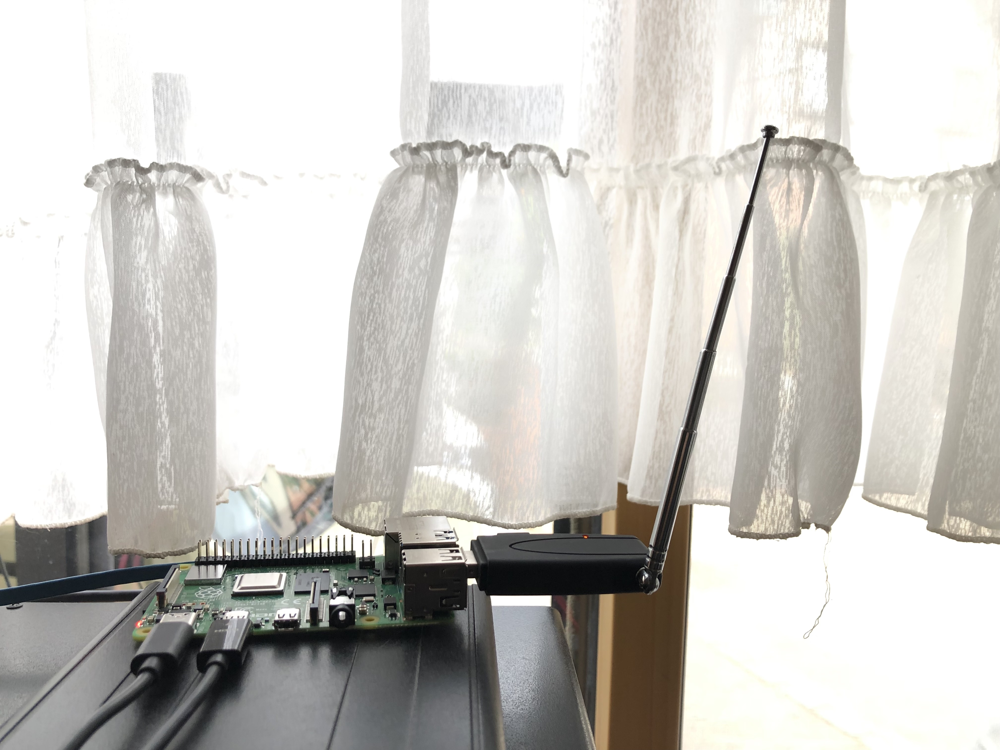</a>
-->
<h3>ラズパイは自分で用意してとの事で、４Bの４GBを先行で入手 3Bか3B+しか作動保証しないと言われましたが、確信犯的に4Bです・・・。</h3>
<a href="20211006_005.jpg" data-lightbox="abc">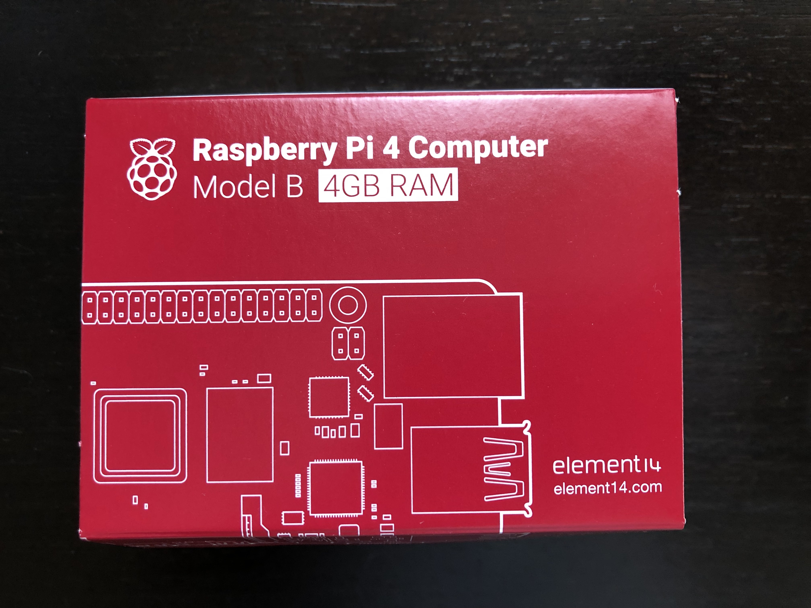</a>

<h3>組み上げるとこんな感じ、左がセンサーで、右がラズパイ。 USBに刺さった特定省電力無線の親機が目立ってます。</h3>
<a href="20211006_007.jpg" data-lightbox="abc">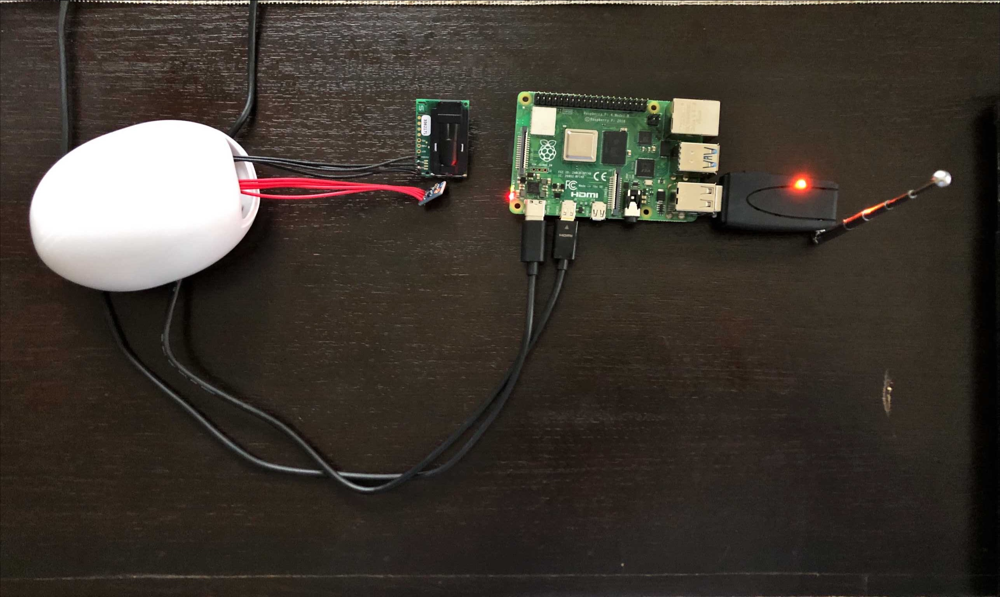</a>

<h3>作動保証のないラズパイ４Bでも全く問題なく動きました。 最終的に、ラズパイに繋いだモニターにCO2濃度、温度、湿度のグラフが表示されています。</h3>
<a href="20211006_008.png" data-lightbox="abc">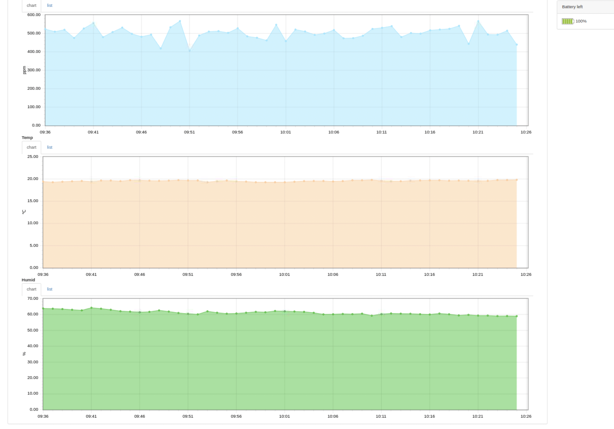</a>

<h3>温度は水銀柱温度計と比べても、かなり正確でした。</h3>
<a href="20211006_006.jpg" data-lightbox="abc">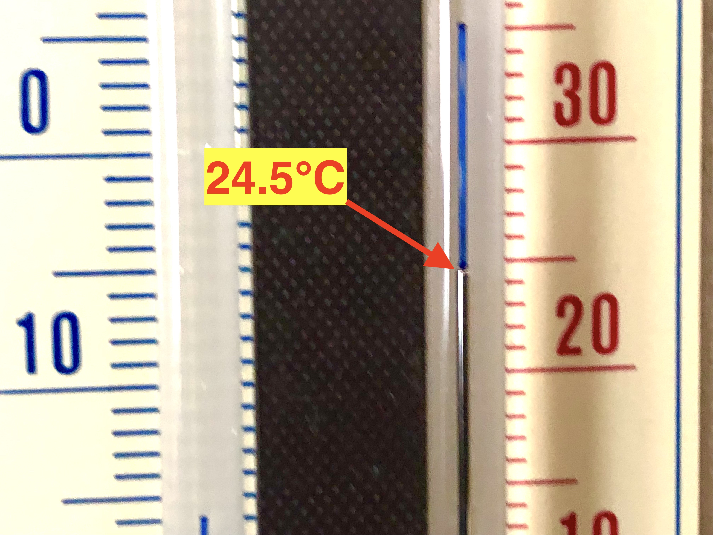</a>
	

<a href="https://cmengineering.co.jp/"</a>最後に学習キットをいただいた会社のHPをリンクします。

<!--

-->
                                          

<h3>今回は面白い、今風のアイテムを頂いて試してみたと言うお話でした。 ここまで観ていただきありがとう御座いました。</h3>

<!-- フッタ -->
 <footer>
 Copyright 2021/10/06 S.Hada
 </footer>

<!--HPにさまざまなJavaScriptを呼び込むための書式-->

</body>

</html>
